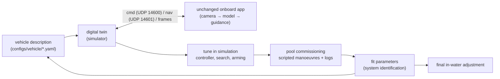

# Digital twin and calibration: simulate the vehicle, then fit it to the real one

**What "digital twin" means here:**
- the unchanged onboard software (camera → model → guidance → commands) drives a simulated vehicle;
- that vehicle's physics and sensors come from one parameter file;
- you tune in simulation first;
- then a short pool session measures the real vehicle, and the parameters are fitted so the twin
  behaves like it;
- final adjustments happen in the water.

The loop repeats whenever the vehicle changes: new ballast, a new thruster layout, a new camera
port.

**Evidence tags** as in docs/TWILIGHT_ZONE.md:
- **[V]** checked in this project: licences and features read from each project's own repository;
- **[L]** literature or documentation seen only through search results (the publishers' sites
  are blocked here);
- **[E]** an estimate or recommendation to test.



## 1. What exists today

- **`talosaur.sim`** is a caricature of the twilight zone, used to tune search and when to leave
  an animal (docs/SEARCH.md §7).
  - It has drifting patches of animals, vertical migration, and avoidance of the vehicle and its
    lamp.
  - Its vehicle is kinematic: commands turn into speeds with one response time. There is no
    hydrodynamics and no rendered camera (`src/talosaur/sim/vehicle.py`).
- **`scripts/replay.py`** runs real video through the identical pipeline.
- **The onboard app talks to the vehicle only through two UDP messages:** commands out on 14600
  and navigation in on 14601 (docs/PI5.md §5).
  - This is what makes software-in-the-loop easy. A simulator only has to speak those two
    messages and supply camera frames.
  - The app itself does not change.

## 1b. The twin on the training box (built)

T1 and the images-mode half of T2 now run in one process on the training machine, with no Pi,
autopilot or GPU needed (the model runs on the CPU, as on the Pi):

```bash
python -m talosaur.sim.twin --encoder runs/<run>/encoder_target.pt \
    --heads reports/eval/<name>/heads_<backbone>_112x208.pt \
    --minutes 20 --start-hour 18.9 --lamp red --video runs/twin/dusk.mp4 --out runs/twin/dusk.json
python -m talosaur.sim.twin --camera truth --minutes 20 --out runs/twin/truth.json   # perfect detector
```

- **Vehicle** (`talosaur.sim.dynamics`, T1): the one-axis-per-DOF model of §6 (mass + added mass,
  linear and quadratic drag, thrust limits, thruster lag, net buoyancy) from
  `configs/vehicle/talosaur_v0.yaml`, with an autopilot for the heading, depth and rate commands
  and noisy depth, compass and gyro. The numbers are BlueROV2-like estimates [E] until the pool fit.
- **Camera** (`talosaur.sim.render`): ambient light falling with depth and time of day, the lamp's
  beam (red or white) with inverse-square falloff, attenuation and a backscatter veil, marine snow,
  bioluminescent flashes, auto-exposure with a gain limit, and noise. The animals are real animals
  cut out of held-out FathomNet test and validation images (never the training split), one
  taxonomic group per simulated species, placed by the guidance camera model.
- **Model**: the network the ONNX export wraps (`build_net`), on the downsampled 208 x 112 frame.
  `--camera truth` swaps in ground-truth heatmaps: the difference between the two runs is the
  model's share of any failure.
- **Loop**: `Guidance.step` gets the frame's brightness and glow grid, as on the Pi; the world's
  animals migrate, drift in patches, and avoid the vehicle and its lamp (`talosaur.sim.world`).
- **Scores**: footage `value` and `animals` as in `sim.run`, plus `peak_hit` (heatmap peak on a
  visible animal), `engaged_empty_s` (engaged with nothing in view) and `target_err_deg`.

**Limits.** The renderer is an approximation for control and model checks, not a substitute for
real footage (§8.3); its optical constants are estimates [E]. It runs in the water's frame (no
current), with no cross-coupling between axes, and it does not yet go through the app's UDP
messages (the out-of-process half of T2). Frames and videos contain FathomNet-derived animals:
keep them local.

## 2. Choosing the simulator

| simulator | what it gives | cost | licence | role |
|---|---|---|---|---|
| **Our own Python twin** (to build) | 4–6-DOF vehicle dynamics from the parameter file, IMU / compass / depth / altimeter with noise, currents. No rendered images. | none: runs in CI and on a laptop | ours | **now**: tune control and search; the model the pool data is fitted to |
| **ArduSub SITL + JSON physics** | the real autopilot code in the loop, with any physics backend | Linux; builds ArduPilot | GPL-3.0 [V] | **when the autopilot is ArduSub**: test depth/heading hold, arming, failsafes, the MAVLink bridge |
| **Gazebo Harmonic** + `ardupilot_gazebo` + `bluerov2_gz` | buoyancy, Fossen hydrodynamics, thrusters; generic (not underwater) camera rendering | Linux; ROS 2 optional | gz-sim Apache-2.0 [V]; ardupilot_gazebo LGPL-3.0 [V]; bluerov2_gz MIT [V] | a ready BlueROV2 example to copy from |
| **Stonefish** | underwater rendering (see below); many sensors; animated bodies; ROS 2 package | Linux; a GPU with OpenGL 4.3; CPU-heavy [V] | GPL-3.0 [V] | **camera realism**: dark water, red lamp, marine snow, moving "animals" |
| **HoloOcean** | Unreal Engine; sonar, camera, DVL and more | a strong GPU | code access requires accepting the Unreal EULA [L]; not reachable from here, licence unverified | an alternative to Stonefish |
| **OceanSim** | NVIDIA Isaac Sim with underwater camera, sonar, DVL and barometer models | tested on RTX 3090, A6000, 4080 Super, 5070 Ti [V]; a 2080 Super (8 GB) is untested | BSD-3-Clause [V]; Isaac Sim has its own licence (not checked) | only if you move to newer GPUs |

**What was verified, per tool:**
- **ArduPilot SITL JSON interface** [V: `libraries/SITL/examples/JSON/readme.md`]:
  - the physics program listens on UDP port 9002;
  - ArduPilot sends binary packets of 16 (or 32) servo PWM values;
  - the physics program answers with JSON: time, gyro and body acceleration, position and velocity
    (north-east-down), and attitude;
  - optional fields such as `rng_1` feed a rangefinder, which is where the echosounder goes.
- **`bluerov2_gz`** [V]:
  - its own notes say the model "has not been tuned";
  - added mass is set to zero, and only quadratic damping is filled in;
  - a `configs.yaml` (mass, centres of mass and buoyancy, thruster positions) generates the model.
  That pattern (one description file, then a generated simulator model) is the one to copy.
- **Gazebo's hydrodynamics system** [V: `Hydrodynamics.hh`] takes added mass via the SDF
  `<fluid_added_mass>` tag. The older `<xDotU>`-style parameters are deprecated. It also supports
  linear and quadratic damping and a constant current.
- **Stonefish** [V: its README and docs]:
  - Water optics are based on Jerlov water types, with absorption and scattering per colour
    channel.
  - Suspended particles look like marine snow.
  - It has water currents, and spot and omni lights with a colour.
  - Sensors include IMU, compass, pressure, DVL, a profiler (a narrow sonar beam), colour, event
    and **segmentation** cameras, forward-looking and scanning sonars.
  - **Animated bodies** move along set trajectories, which can stand in for animals.
  - Its ICRA 2025 paper describes Python bindings for learning [L]. AquaJEPA was evaluated in it.

**Recommendation [E], in order:**
1. **Now: our own Python twin.**
   - It needs no GPU or ROS and runs in CI.
   - It shares its parameter file with the pool fitting code, so the model we tune is the model we
     calibrate.
   - It drives the unchanged app through its two UDP messages.
2. **When the autopilot is chosen as ArduSub:** plug the same Python twin (or Gazebo) into ArduSub
   SITL through the JSON interface. The simulation then runs the real autopilot, arming and
   failsafes.
3. **For the camera:** a Stonefish scene on the training box. Its segmentation camera gives
   ground-truth animal masks for tuning guidance without the model's errors. Its colour camera
   checks exposure, the lamp logic and the model.

**Licences.** ArduPilot and Stonefish are GPL.
- Running them as separate programs that talk to ours over sockets keeps our code under our own
  terms.
- Copying their code into ours would not. That is a legal interpretation [E]: get advice before
  distributing commercially.

## 3. The vehicle description

One file, `configs/vehicle/<name>.yaml`, used by the twin, by the fitting code and, later, to
generate a Gazebo or Stonefish model.

| quantity | first estimate | refined by |
|---|---|---|
| mass, displaced volume | scale; CAD, or the weight in water (volume = (mass − apparent mass in water) ÷ water density) | trim test |
| centre of gravity, centre of buoyancy | CAD; balance the vehicle on an edge along two axes | roll and pitch free-decay test (their separation sets the righting moment) |
| rotational inertia | CAD | free-decay period |
| added mass | the hull as an ellipsoid or cylinder; the standard formulas are in Fossen's handbook [L] | step responses (it shows up as extra effective mass) |
| damping, linear and quadratic, per axis | a similar vehicle: the BlueROV2 values in `bluerov2_gz`, or the experimentally validated BlueROV2 model of von Benzon et al. 2022 [L] | step and sine responses |
| thrusters: positions, directions, thrust vs command, deadband, response time | the maker's bollard curves (Blue Robotics publishes them for the T200 at 16 V [L]) | bollard test with a luggage scale or load cell |
| sensors: rate, noise, mounting | datasheets | a still recording in the pool |
| camera: intrinsics and distortion through the real port | nominal field of view with flat-port refraction (docs/PI5.md §10) | the in-water checkerboard calibration (`scripts/pi/calibrate_camera.py`) |
| lamp: beam angle, level | datasheet | test frames in a tank |

## 4. Software in the loop: the unchanged app against the twin

- **Commands.** The twin listens on UDP 14600 for the app's messages. It acts as the autopilot
  bridge: it follows the rates, or the heading and depth setpoints if a hold mode is modelled.
  It drives the thrusters only while `arming.state` is RUN.
- **Navigation.** The twin sends depth, heading, turn rate, altitude and water temperature to UDP
  14601 (docs/SENSORS.md), with realistic noise and dropouts.
- **Camera** (to build): a new `source.kind: sim` receives frames with their simulation time
  stamps. It has two modes:
  - **masks**: the simulator's ground-truth animal masks, converted to the model's heatmap format.
    This tests guidance, search and control with a perfect detector.
  - **images**: rendered colour frames through the real model. This tests exposure, the lamp and
    how the model copes with rendered scenes. Rendered images are not a substitute for real
    footage for training.
- **Arm switch.** `arming.kind: file` lets a test script arm the simulated vehicle.
- **Time.** The app already works from each frame's own time stamp, so the twin can run faster
  than real time if the app follows simulation time.

## 5. Calibrate in simulation, before the vehicle exists

- **Controller gains** (`guidance.controller`): the yaw and pitch gains, surge, slew limit and
  stand-off. Look for overshoot and oscillation with sensor noise and a current.
- **Search.** `search.speed_mps_per_unit` comes straight from the twin's steady speed per unit of
  surge. Check legs and drifts in a current.
- **Robustness.** Re-run with damping, added mass and thrust each ±30 %. Keep settings that work
  across that range: they will survive the difference between the twin and the real vehicle.
- **Safety logic.**
  - The arm switch and the start in the water.
  - What the bridge does when commands stop.
  - Keeping the bottom limit when the sounder drops out.
- **Camera and lamp** (Stonefish only): `lights.dark_luma` against rendered darkness, and whether a
  ramped lamp stays out of the frame's highlights.

## 6. Commissioning: the first pool session

Budget 1–2 hours in a pool at least 3 m deep. Every step writes logs that the fitting uses.

1. **Static.**
   - Weigh the vehicle in air, then trim it (docs/PREDIVE.md §3).
   - Balance it for the centre of gravity.
   - Zero the depth sensor.
   - Calibrate the compass installed.
   - Run the in-water camera calibration.
2. **Bollard.**
   - Tie the vehicle to a luggage scale or load cell.
   - Step each thruster through its commands, a few seconds each way.
   - This gives thrust against command, the deadband and the asymmetry between forward and
     reverse.
3. **Free decay.** Tilt the vehicle in roll, then in pitch, and let go. The IMU gives the period
   and the decay: the righting moment (the centre-of-gravity to centre-of-buoyancy distance) and
   the rotational damping.
4. **Step and sine responses**, run by a scripted calibration mission (to build), with rest
   between steps:
   - **yaw steps** at 3–4 levels: the gyro measures the turn rate directly;
   - **heave steps**: the depth sensor gives vertical speed. The steady command needed to hover
     is the net buoyancy;
   - **surge steps**: these need a speed reference, since there is no DVL. Use markers on the pool
     wall or floor that the camera sees (AprilTag or ArUco, accurate to centimetres in tanks, but
     sensitive to the calibration medium and range [L]), or timed runs between marked lines.
5. **Fit** (to build: `python -m talosaur.calib.fit logs/...`).
   - Per axis, a one-degree-of-freedom model fitted by least squares in integral form, the classic
     method for small vehicles [L]:
     (mass + added mass) × acceleration = gain × command − linear drag × speed
     − quadratic drag × speed × |speed| + offset.
   - The output is the effective mass, both drag terms, the thrust gain and, for heave, the
     buoyancy offset.
   - It reports the fit error on runs kept out of the fit.
6. **Close the loop.**
   - Put the fitted values into the vehicle description.
   - Replay the pool manoeuvres in the twin and compare the predicted and measured responses
     (plots and RMS error).
   - If they agree, re-tune the controller in the twin and copy the gains into `pi5.yaml`.
7. **Final in-water adjustment.**
   - Small gain changes by hand.
   - Check the approach speed (about 0.25 m/s, docs/SEARCH.md) and the stand-off.
   - Check `search.speed_mps_per_unit`.
   - Take the lamp's `dark_luma` from ambient readings at the first dark dive.

## 7. Milestones

Each milestone is small and testable, in the project's usual way.

| | milestone | test |
|---|---|---|
| T1 | vehicle description file + Python dynamics twin (surge, sway, heave, yaw; roll and pitch self-righting) with sensor models | step responses match the analytic one-axis solutions; buoyancy offset matches trim. **Built** (§1b; roll and pitch not modelled yet) |
| T2 | twin ⇄ app over UDP, plus `source.kind: sim` with the mask mode | the toy model or ground-truth masks close the loop: search, approach, RELEASE, all in CI. **In-process version built** (§1b: truth and rendered-image modes); the UDP link to the app is still to do |
| T3 | scripted calibration mission (runs only when armed) + `calib.fit` + comparison report | parameters are recovered from twin-generated logs with known values and noise |
| T4 | ArduSub SITL through the JSON interface (when ArduSub is chosen) | arm, hold depth and heading, failsafe on lost commands |
| T5 | Stonefish scene: dark water column, red lamp, marine snow, animated animals, segmentation ground truth → app | exposure and lamp logic; guidance against rendered scenes |

T1–T3 do not depend on the autopilot or the simulator choice. T3 can be finished before the
vehicle exists and used on the first pool day.

## 8. Uncertainties

1. **Starting parameters.** For a custom frame, BlueROV2 values are only a starting point. The
   pool decides.
2. **No DVL.** Surge speed can be calibrated in the pool with markers. At sea it cannot be
   checked against currents, so the map of water already searched stays relative to the water.
3. **Rendered images are not real footage.** The model trains and is tested on real footage. The
   simulator's camera is for control, exposure and lamp logic.
4. **Colour.** Stonefish renders red, green and blue, so far-red at 680–700 nm is not modelled on
   its own [E].
5. **OceanSim** has not been tried on a 2080 Super.
6. **Licences.** GPL programs should be kept as separate programs (§2).
7. **Unread sources.** The papers here were seen through search results only; check their
   parameters before relying on them.

## 9. Sources

**Read in this project [V]:**
- ArduPilot: licence (`COPYING.txt`) and the SITL JSON interface
  (`libraries/SITL/examples/JSON/readme.md`), github.com/ArduPilot/ardupilot.
- ardupilot_gazebo: licence, github.com/ArduPilot/ardupilot_gazebo.
- gz-sim: licence and `src/systems/hydrodynamics/Hydrodynamics.hh`, github.com/gazebosim/gz-sim.
- bluerov2_gz: README, `package.xml`, model files, github.com/clydemcqueen/bluerov2_gz.
- Stonefish: `COPYING.txt`, README and docs (sensors, environment, animated bodies),
  github.com/patrykcieslak/stonefish.
- OceanSim: `LICENSE` and installation notes, github.com/umfieldrobotics/OceanSim.

**Seen through search results only [L]:**
- Stonefish: Supporting Machine Learning Research in Marine Robotics. ICRA 2025 (arXiv 2502.11887).
- Potokar E. et al. 2022. HoloOcean: An Underwater Robotics Simulator. ICRA 2022.
- OceanSim: A GPU-Accelerated Underwater Robot Perception Simulation Framework. IROS 2025 (arXiv 2503.01074).
- von Benzon M. et al. 2022. An Open-Source Benchmark Simulator: Control of a BlueROV2 Underwater Robot. *Journal of Marine Science and Engineering*.
- Wu 2018. 6-DoF Modelling and Control of a Remotely Operated Vehicle. Thesis, Flinders University.
- Fossen T.I. 2011. *Handbook of Marine Craft Hydrodynamics and Motion Control*. Wiley.
- Faros I., Tanner H.G. 2025. System Identification and Adaptive Input Estimation on the Jaiabot Micro Autonomous Underwater Vehicle. *Autonomous Robots* (arXiv 2504.02005).
- Seegräber F. et al. 2024. A Calibration Tool for Refractive Underwater Vision (arXiv 2405.18018).
