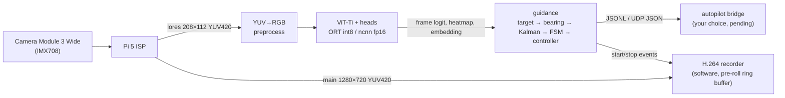

# Raspberry Pi 5 onboard runtime (M6)

How to set up the Pi 5 (1 GB), benchmark the exported models on it, run the onboard vision loop
(camera → model → guidance → commands + recording, one animal at a time), and tune guidance on
recorded video.

Everything here was built and tested on x86. The picamera2 calls are tested against a stand-in
that follows the picamera2 0.3.37 API. **Nothing has run on a real Pi yet.** §14 lists what
still needs checking on hardware.



## 1. Before you have a trained model

You can do the whole Pi side now, while the GPUs train:

```bash
# On the training box: full-size ViT-Ti / ViT-S with random weights, all runtimes (timing and memory
# do not depend on the weights; --calib-random calibrates int8 on noise, so accuracy is meaningless)
python scripts/export.py --encoder random:vit_tiny --calib-random 32 \
    --sizes 112x112 160x160 224x224 112x208 --out exports/bench_tiny
python scripts/export.py --encoder random:vit_small --calib-random 32 --name vit_small \
    --sizes 112x208 160x160 --out exports/bench_small
```

The **toy model** is a colour-contrast "detector": it scores warm colours per 16×16 patch. It
exercises the camera → guidance → recording → UDP chain end to end. In the pool, move an orange
object in front of the camera and watch the state machine and commands respond.

```bash
pip install onnx                                   # only needed to build it
python -m talosaur.onboard.toy_model --out exports/toy --sizes 112x208
python -m talosaur.onboard.app --export-dir exports/toy --model toy_112x208 --runtime ort_fp32
```

## 2. Set up the Pi

1. Flash **Raspberry Pi OS Lite (64-bit)**, the current Debian Trixie release with Python 3.13. Use Lite: no desktop on a 1 GB board.
2. Connect the Camera Module 3 Wide and check it: `rpicam-hello --list-cameras` should list an `imx708_wide`.
3. Clone this repo on the Pi and run the setup script:

   ```bash
   git clone <your repo url> talosaur-JEPA && cd talosaur-JEPA
   bash scripts/pi/setup_pi5.sh            # add --ncnn to also install the ncnn runtime
   source ~/talosaur-venv/bin/activate
   ```

   The script installs `python3-picamera2` and `ffmpeg` from apt, and makes a venv with
   `--system-site-packages` so picamera2 (apt-only) is visible. It then installs `.[pi]`
   (numpy, pyyaml, onnxruntime) and **no torch**, and proves the onboard modules import with
   torch blocked.
4. Copy the export folder from the training box:
   `rsync -av exports/tiny_ctx <user>@<pi-host>:~/talosaur-JEPA/exports/`.
   The folder holds `manifest.json`, the `.onnx` files and `ncnn/`. The runtime reads everything
   it needs from `manifest.json`: input size, grid, output meanings, and which files exist for
   which runtime.

## 3. Benchmark: pick runtime, input size and threads

```bash
# every model x runtime x thread count (each configuration runs in a fresh process)
python -m talosaur.onboard.benchmark --export-dir exports/bench_tiny \
    --runtimes ort_fp32 ort_int8 ort_dyn8 ncnn_fp16 --threads 2 3 4 --out reports/pi5/bench_idle

# the same while the camera records 1080p30 H.264 through picamera2 (the real encoder load)
python -m talosaur.onboard.benchmark --export-dir exports/bench_tiny \
    --runtimes ort_int8 ncnn_fp16 --threads 2 3 4 --record-load picamera2 --out reports/pi5/bench_rec

# 10 minutes flat out: temperature, clock and throttling every 5 s (run it inside the closed hull too)
python -m talosaur.onboard.benchmark --export-dir exports/bench_tiny --models vit_tiny_112x208 \
    --runtimes ort_int8 --threads 1 --iters 10 \
    --sustained-s 600 --sustained-model vit_tiny_112x208 --sustained-runtime ort_int8 --sustained-threads 3 \
    --record-load picamera2 --out reports/pi5/bench_sustained
```

`--record-load x264` substitutes an ffmpeg/libx264 encode when no camera is attached.

Each run writes `.md`, `.csv` and `.json`. Columns:
- **fps (model):** inference alone.
- **fps (loop):** the whole per-frame path: lores YUV → RGB, preprocessing, model, and guidance (blob finding, Kalman, state machine, controller, novelty).
- **ms p50/p90/p99:** latency percentiles.
- **peak RSS MB:** peak memory of that process alone.
- **sys avail MB:** `MemAvailable` from the system.
- **temp °C:** CPU temperature.
- **throttled:** decoded `vcgencmd get_throttled` flags.

**Choosing:**
1. Take the **smallest input** that the M3 evaluation says is accurate enough. 208×112 keeps the full 16:9 field of view.
2. Pick the runtime/thread count with the best **fps (loop)** in the *recording* run. It must reach at least **3 fps with margin**; aim for ≥ 5, since tracking gets smoother with rate.
3. Check that the sustained run shows **no throttling flags**. If it does, fix the cooling before trading accuracy for speed.
4. Leave one core free for the camera, encoder and control: 3 threads is usually right when recording.
5. Put the choice into `configs/onboard/pi5.yaml` (`model.name`, `runtime`, `threads`).

**Reference (not the Pi):** random-weight exports on a 4-vCPU Xeon VM @ 2.1 GHz. The Pi's A76
cores will be several times slower, so read the fps only as relative. Memory is the useful part:
it should carry over to aarch64 roughly.

| model @ 112×208 | runtime | peak RSS MB | fps, 1 thread | fps, 4 threads |
|---|---|---|---|---|
| ViT-Ti | ORT fp32 | 118 | 89 | 136 |
| ViT-Ti | ORT int8 (static) | 96 | 105 | 118 |
| ViT-Ti | ORT int8 (dynamic) | 95 | 125 | 163 |
| ViT-Ti | ncnn fp16 | 84 | 69 | 126 |
| ViT-S | ORT int8 (static) | 128 | 48 | 69 |
| ViT-S | ORT fp32 | 222 | 23 | 58 |

On x86, static int8 is not faster than fp32 at 4 threads. On the A76, which has int8 dot-product
instructions but no i8mm, it may be; that is what the Pi run decides. ncnn fp16 uses the A76's
native fp16 arithmetic, which the x86 run cannot show.

## 4. Run the onboard loop

```bash
# dry run on recorded video (no camera, no recording) - same code path as the vehicle
python -m talosaur.onboard.app --config configs/onboard/pi5.yaml --source video --video dive.mp4

# live, with the camera
python -m talosaur.onboard.app --config configs/onboard/pi5.yaml

# overrides: --export-dir, --model, --runtime, --threads, --no-record, --max-frames, --source synthetic
```

Every `stats_every_s` it logs fps, inference latency, state, memory and temperature, and
publishes the same as a `kind: "stats"` message.

**Start on boot** with a systemd unit, `/etc/systemd/system/talosaur.service`. Replace `<user>`;
recent Raspberry Pi OS images have no default `pi` user.

```ini
[Unit]
Description=Talosaur onboard vision
After=network-online.target

[Service]
User=<user>
WorkingDirectory=/home/<user>/talosaur-JEPA
ExecStart=/home/<user>/talosaur-venv/bin/python -m talosaur.onboard.app --config configs/onboard/pi5.yaml
Restart=on-failure
RestartSec=3

[Install]
WantedBy=multi-user.target
```

Enable it with `sudo systemctl enable --now talosaur`. Watch it with `journalctl -u talosaur -f`.
SIGTERM stops the loop cleanly: the recording is closed and the camera released.

## 5. Output: telemetry and vehicle commands

The autopilot link is still undecided, so the loop publishes one JSON message per frame. It goes
to a JSONL log (`logs/guidance.jsonl`) and to UDP (`127.0.0.1:14600`), both set under `backends:`
in the config. A bridge process turns the commands into whatever your vehicle speaks.
`make_backend` raises `NotImplementedError` for `mavlink` until the stack is chosen.

```json
{"t": 12.4, "kind": "guidance", "frame": 187, "infer_ms": 61.2, "state": "TRACK",
 "frame_prob": 0.93, "novelty": 1.1, "recording": true, "events": [],
 "target": {"found": true, "cx": 0.62, "cy": 0.44, "size": 0.18, "mass": 3.1, "peak": 0.97, "n_blobs": 1, "yaw": 8.9, "pitch": 3.1},
 "track": {"active": true, "confirmed": true, "yaw": 8.5, "pitch": 2.9, "size": 0.18, "yaw_rate": 4.2, "pitch_rate": -0.3, "confidence": 1.0, "hits": 23, "misses": 0},
 "cmd": {"yaw_rate": 0.25, "heave": 0.03, "surge": 0.12}}
```

**Conventions.**
- `target.cx/cy` are normalised image coordinates, with (0, 0) at the top left.
- `yaw` > 0: the target is right of centre. `pitch` > 0: above centre. Both are degrees in the water.
- `size` is √(area fraction) of the animal's blob.
- `cmd` values are normalised requests in [-1, 1]:
  - `yaw_rate` > 0 = turn right;
  - `heave` > 0 = ascend;
  - `surge` > 0 = forward, < 0 = back off.
- `state` is one of SEARCH, ACQUIRE, TRACK, FILM, LOST and RELEASE (moving on after an animal's time budget, §12).
- `events` carries `encounter_start`, `encounter_end`, `start_recording`, `stop_recording` and `state:<NAME>`, in that order within a frame.
- `encounter` (`id`, `engaged_s`, `remaining_s`) is the animal being filmed. `reid` gives the target's appearance similarity to animals already filmed (`sim`), how many filmed animals in view were skipped, and how many are remembered.
- At the end of each encounter, a `kind: "encounter"` message summarises it (§12).

**Safety stays with the autopilot.** Depth and altitude limits, obstacle avoidance, leak and
battery failsafes all belong there. Vision only sends requests, already clipped, slew-limited and
with a hard stand-off. The bridge should treat a message older than ~0.5 s (by receive time) as
"all zero", so a crashed or stalled vision process never leaves a stale command active.

## 6. Recording

The Pi 5 has **no hardware H.264 encoder**. picamera2's `H264Encoder` is the software libav/x264
encoder there, and it competes with inference for the four cores. The recording follows the state
machine: it starts on entering TRACK, continues through FILM and LOST, and stops `postroll_s`
after leaving them, either back to SEARCH or into RELEASE when the animal's time budget is used up
(§12). Long recordings roll over into a new file every `max_record_s`.

| setting | effect |
|---|---|
| `recording.preroll_s: 5` (default) | the encoder runs **all the time** into a 5 s ring buffer, so the approach before TRACK is saved; pays the encoder CPU while searching |
| `recording.preroll_s: 0` | the encoder runs only while recording; loses the approach footage, saves the CPU during SEARCH |
| `source.main_size: [1280, 720]` (default) vs `[1920, 1080]` | 720p costs roughly half the encode CPU of 1080p |
| `recording.bitrate: 6000000` | 6 Mbit/s ≈ 2.7 GB per hour of recording |
| a separate action camera | no Pi CPU at all; vision still decides where to point the vehicle |

Files are raw H.264 (`recordings/talosaur_YYYYmmdd_HHMMSS_NNN.h264`; `logs/encounters.jsonl` says
which animal each file shows). Wrap one without re-encoding:
`ffmpeg -framerate 15 -i talosaur_X.h264 -c copy talosaur_X.mp4`. The encoder writes a keyframe
every second, so the pre-roll starts at most 1 s later than configured.

## 7. Memory budget (1 GB)

| item | expected |
|---|---|
| OS (Lite, no desktop), services | measure with `free -m` on your image |
| vision process: Python + numpy + onnxruntime + ViT-Ti int8 | ~100 MB peak RSS (x86 reference above; the benchmark measures the Pi) |
| camera buffers (4 × 1280×720 YUV420 + lores) | ~6 MB of CMA memory, outside the process RSS |
| software H.264 encoder | measure: compare `free -m` with `recording.preroll_s` 0 vs 5 |

ViT-S int8 (~130 MB) also fits. Keep the zram swap that Raspberry Pi OS enables by default as a
safety net, but a healthy run should never touch it. The benchmark's `sys avail MB` column
shows the headroom.

## 8. Thermals

The Pi 5 firmware lowers the CPU clock when the SoC gets hot, and inference then slows down
without any error. A sealed hull has no airflow. Use the active cooler, or better, a heat path to
the hull wall (for example an aluminium plate to the end cap). Run the sustained benchmark inside
the closed hull, in water at your operating temperature. The timeline shows temperature, clock and
throttle flags every 5 s. The app also logs temperature and `throttled` in its stats messages.

## 9. Camera settings underwater (`source.controls` in `pi5.yaml`)

- **Focus: manual.** Autofocus hunts in murky water. Set `AfMode: 0` and `LensPosition` in dioptres (1/m).
  - Behind a flat port, objects look ~25% closer (virtual image at d/1.33).
  - To focus on animals ~d m away in water, set `LensPosition ≈ 1.33 / d`. For example, 0.9 for 1.5 m.
  - The config default is 1.0, about 1.3 m in water. Confirm in the pool.
- **Exposure: `AeExposureMode: 1` (short).** Less motion blur at the price of more gain and noise, which the model was trained to tolerate (the degradation augmentation).
  - The frame rate (`fps: 15`) caps the exposure at ~66 ms.
- **White balance.** AWB can be fooled by a scene that is all blue-green. If colours pump, fix the gains after a pool test with `AwbEnable: false` and `ColourGains: [r, b]`.
- **HDR** (`source.hdr`): `sensor` (IMX708 on-sensor HDR, limits the sensor mode to 2304×1296), or `isp` / `night` (Pi 5 ISP modes). **Untested**: compare against `off` on the same pool scene before using one.
- **Stream shape.** The model's input comes from the ISP's lores stream, scaled from the same full-field crop as the recording stream. A small aspect mismatch (208×112 vs 16:9) stretches it by ~4%. That is harmless: the camera model works in normalised coordinates.

## 10. Camera model and underwater calibration

Guidance converts the target's image position into bearing and elevation (`guidance.camera`):

| `port` | model |
|---|---|
| `flat` (default) | nominal 102°×67° in-air field of view, then Snell refraction at a flat port (n = 1.333): ~71°×49° in water |
| `dome` / `air` | nominal field of view unchanged (a well-centred dome keeps it) |
| `calibrated` | intrinsics **and lens distortion** measured in water through the actual port |

The nominal models ignore the wide lens's barrel distortion, which grows toward the edges. Once
the housing is final, calibrate in water:

```bash
sudo apt install python3-opencv
python scripts/pi/calibrate_camera.py capture --out calib_imgs --n 30    # move a printed checkerboard around the whole view, 0.5-2 m
python scripts/pi/calibrate_camera.py solve --images calib_imgs --board 9x6 --square 0.025
```

Copy `fx, fy, cx, cy, dist` from `camera_calibration.yaml` into `guidance.camera` and set
`port: calibrated`. The values are normalised by image size, so they apply to the lores stream
too, since it shows the same field of view.

## 11. Tuning guidance on recorded video

```bash
python scripts/replay.py --video dive.mp4 --export-dir exports/tiny_ctx --model vit_tiny_112x208 \
    --runtime ort_int8 --pi-fps 6 --out replay_dive.mp4      # --pi-fps = the loop fps you measured
```

Replay runs the exact onboard pipeline on your desktop or on the Pi. It drops frames to the Pi's
rate, so the tracker sees what the vehicle would, and writes:
- an annotated video: heatmap, detected centroid, filtered track, state, the animal being filmed and its time left, the appearance similarity to animals already filmed, command bars, and a red dot while recording;
- `replay_dive.jsonl` with the per-frame telemetry;
- `replay_dive.encounters.jsonl` with one line per animal (§12).

Knobs in `pi5.yaml` → `guidance:`:

| knob | raise it when | lower it when |
|---|---|---|
| `heat_thr` (seed) | specks and backscatter start tracks | small / distant animals are missed |
| `heat_thr_low` (extent) | blobs merge with the background | apparent size is underestimated |
| `min_mass` | single bright specks pass | one-patch animals are rejected |
| `fsm.acquire_n` / `acquire_m` | false acquisitions | slow to react |
| `fsm.film_center_deg`, `film_size`, `film_hold_s` | FILM flickers | FILM never reached |
| `controller.target_size` / `standoff_size` | it stays too far / too close | — |
| `controller.yaw_kp`, `yaw_kd`, `slew_per_s` | sluggish turning | oscillation around the target |
| `encounter.same_sim` | different animals are taken for one already filmed | the same animal is filmed again as "new" |
| `encounter.max_s` | too little footage per animal | it lingers on one animal |

Keep the vehicle's own turn rate in mind. Replay is open loop: the recorded camera does not turn
toward the target, so a target crossing the frame never looks centred for long.

## 12. One animal at a time: time budget, moving on, not filming the same fish twice

Each animal gets a time budget. When it is used up, the sub stops documenting that animal, moves
away, and looks for a *different* one. Settings are under `guidance.encounter` in `pi5.yaml`.

1. **Encounter.** Locking onto an animal (ACQUIRE → TRACK) starts an encounter: a new id and a
   recording.
2. **Budget** (`max_s`, default 60 s). Time in TRACK, FILM and LOST counts. When it is used up, the
   state machine enters **RELEASE**:
   - the recording stops after its post-roll;
   - the sub backs off (`controller.release_backoff_s`);
   - it turns away from the side the animal was on (`release_turn_s`);
   - it swims on for the rest of `fsm.release_s` (default 12 s);
   - detections are ignored meanwhile; then SEARCH resumes.
3. **Recognising animals already filmed, by appearance rather than position.** Underwater position
   is unreliable, so it isn't used. The model exports its per-patch features (`patch_tokens`).
   The sub averages them over the animal's heatmap blob, subtracts the average background (water)
   features, and compares the result with each remembered animal by cosine similarity:
   - **Budget already spent** (similarity ≥ `same_sim`): the animal is ignored for `cooldown_s`
     (default 5 min), even while it stays in view. If another animal is in view at the same time,
     that one is chosen instead.
   - **Only lost** (it swam out of view before its budget ran out): it is **resumed** with the time
     it has left. A fish that keeps coming and going is still filmed for at most `max_s` in total.
4. **Encounter log.** Every encounter is written to `logs/encounters.jsonl`, and also sent as a
   `kind: "encounter"` message on the backends. Each line records:
   - the animal's id;
   - why it ended (`budget`, `lost`, or `shutdown`);
   - total time on that animal;
   - time well framed (FILM);
   - the best-framed moment (`best_t`);
   - the video files.

   ```json
   {"kind": "encounter", "id": 3, "reason": "budget", "engaged_s": 60.1, "film_s": 22.4,
    "resumed": true, "best_t": 431.7, "recordings": ["recordings/talosaur_20261003_101512_004.h264"]}
   ```

**Limits and calibration.**
- **Look-alikes.** Appearance separates animals that *look* different. Two fish of the same species
  and size (a school) look the same, so after one budget the sub leaves the whole school alone for
  `cooldown_s`.
- **Threshold.** `same_sim: 0.8` is a starting guess; the right value depends on the trained model.
  To set it:
  1. Run replay on footage where the same animal comes back, and on footage where a different one
     appears. Replay logs every similarity (`reid.sim`, and `sim=` on the overlay).
  2. Set `same_sim` between the two groups of values.

  On the toy model, a returning fish scores ~1.0 and a differently coloured fish 0.67.
- **Manoeuvre.** The move-on manoeuvre is timed (seconds of turning, not degrees) until the vehicle's
  turn rate is calibrated.
- **Older exports.** Exports made before this change have no patch tokens. The sub still moves on
  after each budget but cannot recognise animals, and the app warns at start. Re-export with
  `scripts/export.py`. The parity report's `token cos` column shows that int8 keeps these features.
- **No limit.** `max_s: 0` disables the budget: follow indefinitely, as before.

## 13. Optional: ncnn int8

This path is **untested here**; ORT int8 and ncnn fp16 are the tested ones. You need ncnn's
`ncnn2table` and `ncnn2int8` tools, from a release matching your `ncnn` pip version or built from
source. In current ncnn, `ncnn2int8` quantizes the Gemm (MLP) weights itself and requires a
calibration table for MultiHeadAttention.

```bash
# on the training box: save the stratified calibration images as .npy
python scripts/export.py ... --ncnn-calib          # -> exports/<name>/ncnn/calib_<model>/calib_list.txt
cd exports/<name>/ncnn
ncnn2table vit_tiny_112x208.ncnn.param vit_tiny_112x208.ncnn.bin calib_vit_tiny_112x208/calib_list.txt \
    vit_tiny_112x208.table shape=[208,112,3] method=kl type=1        # shape is [w,h,c]; type=1 = npy input
ncnn2int8 vit_tiny_112x208.ncnn.param vit_tiny_112x208.ncnn.bin \
    vit_tiny_112x208_int8.ncnn.param vit_tiny_112x208_int8.ncnn.bin vit_tiny_112x208.table
```

Then add `"ncnn_int8_param": "ncnn/vit_tiny_112x208_int8.ncnn.param"` and
`"ncnn_int8_bin": "ncnn/vit_tiny_112x208_int8.ncnn.bin"` to that model's `files` in
`manifest.json`, and benchmark `--runtimes ncnn_int8`. Before deploying it, check its accuracy
with replay on labelled clips, or with `scripts/eval.py`.

## 14. Not yet verified on hardware

1. **All Pi numbers**: fps, memory, thermals, and the CPU cost of recording while running inference.
2. **picamera2 behaviour.** Checked only against the 0.3.37 API with a fake camera:
   - lores YUV420 capture and the configured sizes;
   - `CircularOutput` pre-roll with the libav encoder;
   - `iperiod` / `framerate` on the encoder;
   - the HDR modes.
3. The ncnn int8 conversion (§13).
4. The in-water calibration workflow and the flat-port focus rule of thumb.
5. Camera controls in the dark: gain limits and noise at depth.
6. **Recognising animals with the trained model** (§12). Tested only with synthetic features and the toy model's colours. How well JEPA patch tokens separate real animals, and the right `same_sim`, must come from your footage.

## 15. What to send back

- `reports/pi5/bench_idle.md`, `bench_rec.md` and `bench_sustained.md`, plus their `.json` files.
- `free -m` output with the app idle in SEARCH, and while recording.
- One short pool clip with the toy or trained model, plus its `logs/guidance.jsonl` and `logs/encounters.jsonl`. Replay it on the desktop to tune.
