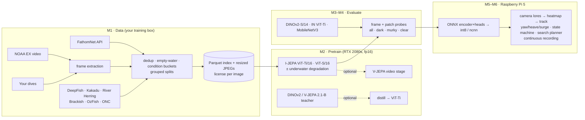

# Talosaur Vision: Plan and Project Structure

**Status:** proposal, awaiting approval. No pipeline code has been written yet.
**Date:** 2026-09-28 · **Scope:** Raspberry Pi 5 (1 GB, CPU only) + Camera Module 3 Wide onboard; RTX 2080-class GPUs for training. Jetson and later upgrades are out of scope for now.

---

## 0. Summary

This repo will hold one config-driven pipeline:

1. **Curated underwater dataset.** Frames and stills from verified sources are deduplicated, empty open water is downsampled, and every image is tagged with a light/turbidity bucket. Splits are grouped by dive, video, or deployment. Every image carries its license.
2. **I-JEPA pretraining of ViT-Tiny/16**, with ViT-Small/16 for comparison, on the 2080s. An optional underwater-degradation module can be switched on per run for ablations. Optional stages: V-JEPA video pretraining, and distillation from DINOv2 or a V-JEPA 2.1 ViT-B teacher.
3. **Frozen-feature evaluation.** A frame-level "animal present" probe and a per-patch heatmap probe, reported separately on **dark / murky / clear** subsets. Baselines: DINOv2 ViT-S/14, ImageNet ViT-Tiny, and MobileNetV3.
4. **Deployment.** Encoder and both heads are exported as one ONNX graph, int8 static-quantized with an underwater calibration set, and benchmarked on the Pi 5 with ONNX Runtime and ncnn. The Pi 5 runtime uses no PyTorch.
5. **Guidance and recording (expansion).** Heatmap → target bearing, elevation, and apparent size → filtered track → yaw/heave/surge commands. A SEARCH → ACQUIRE → TRACK → FILM → LOST → RELEASE state machine decides what the vehicle does:
   - a search planner chooses depth bands and headings from detections, time of day and the water already covered;
   - a foraging-theory rule decides how long each animal is worth filming before moving on;
   - video is recorded continuously, with every animal indexed into it ([`docs/SEARCH.md`](SEARCH.md)).



**What I can and can't do from here.** This sandbox has no GPU, no Pi, and its network policy blocks the dataset hosts (FathomNet, NOAA, Hugging Face, and others). I can build and unit-test every stage on CPU using synthetic data and tiny models. You run the real downloads, training, and Pi benchmarks with the scripts and checklists I provide, then send back the reports they generate so I can tune from them.

---

## 1. What the vehicle needs from vision

| Mode | Vision output | Latency/rate need | Failure that matters most |
|---|---|---|---|
| SEARCH | p(animal / interesting) per frame, novelty score | ≥ 1–3 Hz | false alarms on marine snow/backscatter; missed dim animals |
| ACQUIRE/TRACK | heatmap → centroid (bearing°, elevation°), apparent size, confidence | ≥ 3 Hz, stable | jitter, jumps between targets, lock onto lights/specks |
| FILM | "keep framing" + stand-off from apparent size | ≥ 3 Hz | approaching too close; losing target at edge of wide FoV |

The robustness question in the brief ("does it still work when dark, murky, lit by our own lamps?") is how every stage below is evaluated.

---

## 2. Key design decisions

| Decision | Choice | Reason |
|---|---|---|
| Mixed precision on 2080s | **fp16 autocast + GradScaler** (`torch.amp`), not bf16 | Turing (sm_75) has fp16 tensor cores but **no bf16 or TF32**. PyTorch runs bf16 autocast there *silently*, emulated and slower than fp32, and bf16 also disables the memory-efficient attention kernel. The official I-JEPA training code has **only** a bf16 switch, so ours differs on purpose. |
| Attention kernel | PyTorch SDPA (memory-efficient backend, fp16) for training; plain matmul path for ONNX export | On sm_75 the Flash and cuDNN SDPA backends need sm80+, and so does FlashAttention-2. We don't rely on `torch.compile` either, because Triton officially targets compute capability ≥ 8.0. |
| PyTorch version | Pin **torch 2.14.0**. Use the default CUDA 13.0 build if `nvidia-smi` shows driver ≥ 580, otherwise the CUDA 12.6 build (driver ≥ 525.60). | Turing is now the oldest architecture CUDA 13 supports. Pinning avoids a surprise drop. |
| Reference code | **Reimplement I-JEPA** from the paper, the official configs, and the collator behaviour. Adapt **V-JEPA 2 code (MIT)** with attribution where useful. **Copy no code** from `facebookresearch/ijepa` or `facebookresearch/jepa`. | Both of those repos are **CC BY-NC 4.0** (verified). Copying from them would make this repo non-commercial. The official code stays a *reference*: a parity mode reproduces the official mask statistics exactly (§4.1). |
| Position encoding | Fixed 2-D sin-cos, no CLS token (as in I-JEPA) | One trained encoder can run at 112/160/224 px and at non-square grids without retraining. |
| Onboard input shape | Square 112/160/224 (the benchmarks you asked for) **plus 16:9 grids**, e.g. 208×112 → 13×7 patches | The camera is 16:9 wide. A square crop throws away ~44% of the horizontal field of view, while 208×112 costs about the same as 160×160 (0.54 vs 0.59 GMACs for ViT-Ti). |
| Underwater degradation | Batched on the GPU, physically motivated, with modes **off / shared / context_only / independent** | `context_only` (degraded context, clean target) turns augmentation into a robustness objective: predict clean-scene features from a degraded view. It is a clean ablation axis. |
| Splits | Grouped by dive / video / deployment / site, plus cross-source near-duplicate removal | Frames from one dive in both train and test inflate every metric. FathomNet also hosts NOAA imagery, so the same scene can appear in two sources. |
| Config & logging | Hydra + YAML; TensorBoard by default, W&B optional; fixed seeds; resumable atomic checkpoints | Ablations become `-m degrade=off,context_only`. |
| Onboard runtime | numpy + onnxruntime (or ncnn) only; the ISP scales the camera's low-res stream | 1 GB of RAM. PyTorch alone would use a large fraction of it. The ISP does the resize for free. |
| Recording | Recording is a vision-driven decision (state machine), with a pre-roll buffer | **Confirmed:** the Pi 5 has no hardware H.264 encoder. The official BCM2712 docs put software 1080p30 encoding at about 30–40% CPU, and picamera2 switches to a libav (x264) encoder on the Pi 5. Encoding competes with inference for the same four cores. |

---

## 3. Data

### 3.1 Sources

Full verification details, exact access commands, and license quotes are in [`docs/DATASETS.md`](DATASETS.md). Most dataset hosts are blocked from this sandbox, so each fact there is tagged READ (primary file read), SEARCH (search results only), or UNVERIFIED.

| Source | Role | Conditions it covers | License (short) |
|---|---|---|---|
| FathomNet (MBARI) | pretraining; patch probe (boxes) | deep/midwater, ROV-lit, dark | per upload CC0 / BY / BY-NC / BY-NC-ND; **ToS explicitly allows ML training**; never redistribute images |
| NOAA Ocean Exploration (Okeanos `EX` cruises) | pretraining; V-JEPA clips | deep dives incl. Gulf of Mexico, marine snow | public domain (EX cruises only; no bulk API) |
| DeepFish | **frame probe** (fish/no-fish); masks | tropical coastal, mostly clear | CC BY 4.0 |
| Kakadu freshwater fish | patch probe; pretraining | **freshwater** billabongs | CC BY 4.0 |
| MIT River Herring (LILA) | **frame probe; dark slice** | freshwater river, ~35% night | CDLA-Permissive-1.0 |
| Brackish (AAU) | **murky-slice** evaluation | turbid, LED-lit | **conflicting reports; likely CC BY-SA 4.0**; you confirm on Kaggle |
| OzFish (AIMS) | pretraining frames | coastal BRUV | CC BY |
| Ocean Networks Canada | pretraining (dark, lights on/off) | deep fixed cameras | CC BY 4.0 for ONC-owned devices; partner devices vary |
| **Your dives** | **murky freshwater test set** | the target domain | yours |

**Deferred:** SEAMAPD21, a Gulf of Mexico reef-fish video set, states no license; worth asking NOAA SEFSC. Also deferred: Fish4Knowledge (low relevance), and UIEB, LSUI, TrashCan, and Schmidt Ocean (non-commercial or academic-only terms).

**License posture (your decision, §11).** The pipeline stores `license`, `source`, `attribution`, and `commercial_ok` for **every image**. Any training set can then be rebuilt with, for example, `curate.license_filter=commercial_ok`. Whether model weights trained on NC data may be used commercially is legally unsettled. If commercial use is a possibility, we keep a "clean" training variant from the start.

### 3.2 Curation pipeline (`talosaur.data`)

1. **Fetch.** One module per source. Each prints the source's license and requires `--accept-license <id>` before downloading. It writes a manifest (URL, checksum, license, attribution, retrieval date).
   - FathomNet: pages through the API with at most 4 workers and backoff, resizing on the fly. The originals would be ~1.5 TB of PNGs; resized it's ~30 GB. The per-image license is read from its upload record.
   - NOAA: works from a URL manifest you export from the video portal. The low-res H.264 files are enough for training frames.
2. **Frame extraction from video** (ffmpeg).
   - Sample at 1–2 fps, with scene-change boosting.
   - Detect burned-in HUD/text overlays with a temporal median plus an edge-persistence mask, then crop or mask them.
   - Keep `(source, video_id, t)` for grouping and for later V-JEPA clips.
3. **Deduplication**, three levels:
   - (a) temporal: skip a frame if its pHash is ≤ 6 bits from the last kept frame and SSIM > 0.9;
   - (b) global: pHash buckets across all sources;
   - (c) optional embedding pass: DINOv2-S or MobileNetV3 features, FAISS cosine > 0.95.
   - Duplicates of any eval/test image are removed from the pretraining pool.
4. **Quality and condition metrics** (on a 256-px copy):
   - mean and 95th-percentile luminance;
   - RMS contrast;
   - underwater dark-channel haze (G/B channels);
   - colour-cast magnitude and hue (CIELAB a\*/b\*), and red-attenuation ratio;
   - Laplacian-variance blur;
   - noise σ (Immerkær);
   - UCIQE.
5. **Condition buckets.** Light: *dark / dim / bright*. Clarity: *murky / moderate / clear*. Thresholds come from dataset percentiles and are validated against about 300 hand-labelled images (a small labelling CLI is included). The eval slices *dark*, *murky*, and *clear* are defined from these buckets.
6. **Empty open-water detection.** Low gradient energy, low local variance, and no bright blobs mark a frame as empty. Keep a configurable fraction (default 10–15%) as negatives. Once we have a trained encoder, the detector can be refined with a probe instead of the heuristics.
7. **Balancing.** Per-image sampling weights ∝ 1 / bucket frequency (capped), plus per-source caps so one long NOAA dive can't dominate. Stored in the index; used by a weighted sampler.
8. **Grouped splits.** `train / val / test` by group id. Probe/eval test sets are frozen and hashed.
9. **Storage.** Short side resized to 288 px for pretraining and 512 px for eval images with boxes. JPEG q=90 plus a single **Parquet index** (path, source, license, group, split, size, metrics, bucket, weight, labels, boxes).
10. **Dataset report** (`reports/dataset/<name>.md` + JSON + plots):
    - counts per source, license, split, and bucket (3×3 light × clarity grid);
    - dedup and empty-water removal counts;
    - resolution and metric histograms per source;
    - label balance;
    - **box-size distribution in patches at 112/160/224 and 208×112.** This shows directly what fraction of animals are smaller than one 16-px patch at each deploy size, which is the main evidence for choosing 112 vs 160.

### 3.3 Your own pool/lake footage

It goes through the same video path with `source=talosaur_dives, license=own`. Labelling uses CVAT or Label Studio (boxes) or our frame-label CLI. Your lake footage becomes the most important **murky-freshwater test set**, because no public dataset matches it exactly.

---

## 4. Pretraining

### 4.1 I-JEPA for small ViTs (`talosaur.ssl.ijepa`)

- **Encoders.**
  - ViT-Ti/16: dim 192, depth 12, 3 heads, 5.5 M params.
  - ViT-S/16: dim 384, depth 12, 6 heads, 21.7 M params.
  - Both: 2-D sin-cos positions, no CLS token, rectangular grids supported.
- **Predictor.** Narrow ViT: default dim 128, depth 6 for Ti; dim 192, depth 6 for S. Ablate width and depth. (I-JEPA found a narrow predictor helps.)
- **Masking.** The official I-JEPA multi-block recipe. These are the values every shipped config uses; the class defaults in the code differ.
  - 1 context block, scale 0.85–1.0;
  - 4 target blocks, scale 0.15–0.2, aspect ratio 0.75–1.5;
  - `min_keep` 10, no overlap; targets are removed from the context.
- **Masking quirks in the official collator.**
  - One random draw sets both a block's scale and its aspect ratio.
  - The context block is always square.
  - All masks in a batch are cut to the shortest one.
  - `randint(0, H−h)` means **a block never touches the bottom or right edge**. On a 10×10 grid that leaves ~19% of patches never predicted, which hurts heatmaps at the image border.

  Our collator fixes the edge bias and the correlated draw by default. `masks.official_compat=true` reproduces the official behaviour exactly, for parity tests and as an ablation.
- **Target and loss.** EMA target encoder (momentum 0.996 → 1.0, linear), smooth-L1 on layer-normed target features at target positions.
- **Optimisation.**
  - The official ViT-H recipe: batch 2048 across 16 GPUs; AdamW lr 1e-3 (starting at 2e-4, 40-epoch warmup, cosine to 1e-6); weight decay 0.04 → 0.4; 300 epochs; random-resized crop 0.3–1.0 and no other augmentation.
  - On 8 GB cards we run batch 256–512 per step: LR scaled linearly, a shorter warmup, and optional gradient accumulation. These are retuned on the first short runs.
  - The official predictor is 384 wide for ViT-H, with depth from the config.
- **Resolution.** Default pretrain at 224 (Ti and S) with probes at 112/160/224/208×112. A Ti variant uses multi-resolution batches (128–224) so small inputs are in-distribution.
- **Init options.** `init=scratch` (default), `init=imagenet` (timm ViT-Ti weights, then continued I-JEPA on underwater data), `init=distilled` (from §4.4). This is the practical "what gets the best Pi model" comparison.
- **Engineering.**
  - fp16 AMP + GradScaler;
  - DDP via `torchrun` on 1–N GPUs;
  - optional gradient checkpointing (ViT-S on 8 GB);
  - atomic `latest.pt` + periodic checkpoints holding model, EMA, predictor, optimizer, scaler, schedules, sampler and RNG state; auto-resume;
  - the run directory saves the resolved config, git SHA, and `pip freeze`.

### 4.2 Underwater degradation (`talosaur.augment.degrade`, flag `degrade=`)

A batched torch module that runs on the GPU after loading. Every op has a probability and a severity range and is seeded. It is loosely based on the revised underwater image-formation model: direct attenuation plus backscatter over a random smooth range field *z(x)*.

1. **Wavelength-dependent attenuation.** `J·exp(−β_c z)`. Presets: *ocean blue*, *coastal green*, *lake green-brown (CDOM)*.
2. **Backscatter veil / haze.** `B∞_c·(1 − exp(−β_B z))`.
3. **Artificial light.** Spotlight cones, inverse-square falloff, vignetting. A "no ambient light" deep mode where only lit regions are visible. Red-light illumination is an option.
4. **Low light.** Exposure 0.02–0.5×, gamma, 8-bit quantisation.
5. **Sensor noise.** Poisson–Gaussian in linear space, chroma noise, optional ISP-denoise smear.
6. **Backscatter specks / marine snow.** Density, size, brightness, defocus, and motion streaks, denser near the light. These are the main false-positive source for the heatmap, so they also appear in evaluation.
7. **Blur.** Defocus, motion, forward-scatter.
8. **Compression.** JPEG/H.264-like blockiness at low bitrate.

**Modes:**
- `off` — baseline.
- `shared` — same degraded image for context and target; plain augmentation.
- `context_only` — degraded context, clean target; the robustness objective.
- `independent` — independent degradations for context and target.

Details:
- Ops skip themselves on inputs that are already severe. For example, low light is not applied to images whose mean luminance is below 0.1.
- For video, the water parameters are consistent across a clip, while the particles move from frame to frame.
- `scripts/viz_degrade.py` writes sample grids so you can sanity-check realism.
- With `context_only`, the context and target encoders differ. **Both are evaluated.**

### 4.3 Optional: V-JEPA video stage (`talosaur.ssl.vjepa`)

- **Clips.** 16 frames at stride 2–6 from 30 fps source, 128–160 px, pre-extracted to low-res clip shards so decoding doesn't starve the GPU.
- **Masking and loss.** 3-D multi-block tube masking with the verified V-JEPA defaults:
  - tubelet 2, 16 frames, sampling rate 4;
  - 8 blocks at spatial scale 0.15 plus 2 at 0.7, each spanning the whole clip;
  - aspect 0.75–1.5; L1 loss; EMA 0.998 → 1.0.
- **Tokenizers.** Following V-JEPA 2.1 (MIT): a separate **image tokenizer (tubelet 1)** and **video tokenizer (tubelet 2)** feed one shared transformer, with a learned modality embedding. Images and clips are interleaved during training. The onboard single-frame path therefore benefits from video pretraining without any change to deployment.
- **Initialisation.** From the I-JEPA checkpoint.
- **Optional 2-frame deployment mode.** Feed (previous, current) frames through the video tokenizer, at the same token count as one image. That gives the encoder motion cues at almost no extra Pi cost. Single-frame stays the default.

### 4.4 Optional: distillation into ViT-Ti (`talosaur.ssl.distill`)

- **No official I-JEPA or V-JEPA weights exist at Tiny or Small size** (verified). The smallest JEPA checkpoint is V-JEPA 2.1 ViT-B/16. Teachers, most permissive licence first:
  1. **DINOv2 ViT-S/14 or ViT-B/14.** Apache-2.0 for both code and weights; the default.
  2. **V-JEPA 2.1 ViT-B/16.** 80 M parameters, 384 px, itself distilled from ViT-G; MIT. This is the "larger pretrained JEPA" teacher and fits on a 2080. Its torch.hub loader on `main` points at `localhost`, so we load the checkpoint file directly.
  3. DINOv3 ViT-S/16 or ViT-S+/16. Under the DINOv3 License: commercial use is not prohibited, but downloads are gated and **military/warfare uses are banned**.
  4. I-JEPA ViT-H/14. CC BY-NC, so research use only.
- **Patch-token distillation.** For DINOv2, a student at 224 px/16 and a teacher at 196 px/14 both give **14×14 grids**, so no interpolation is needed. For V-JEPA 2.1 (also /16), the teacher runs at 224. Loss is cosine plus smooth-L1 through a linear projector, plus a pooled-token term.
- Runs to compare: scratch-JEPA, distill-only, distill → JEPA, and JEPA + λ·distill.
- Teacher features can be cached for fixed crops to save 2080 time.

### 4.5 Collapse monitoring and in-training probes

Every N steps on a fixed batch:
- per-dimension std of L2-normalised embeddings (healthy ≈ 1/√D);
- RankMe effective rank of pooled and patch embeddings;
- predictor-output std;
- target/context cosine;
- grad-norm, AMP scale, and EMA momentum.

Alarms: a warning (or optional stop) if rank drops below 10% of D or std collapses.

Every K epochs: a periodic linear probe on cached probe sets. Frame AUROC, patch AUROC, and centroid error are logged next to the loss, so we can see whether the representation is improving and not just the loss falling.

### 4.6 Experiment grid (initial)

| ID | Model | Res | Degrade | Init | Purpose |
|---|---|---|---|---|---|
| E1 | ViT-Ti/16 | 224 | off | scratch | baseline |
| E2 | ViT-Ti/16 | 224 | context_only | scratch | robustness objective |
| E3 | ViT-Ti/16 | 224 | shared | scratch | augmentation-only control |
| E4 | ViT-Ti/16 | 128–224 multi-res | best of E1–3 | scratch | small-input deployment |
| E5 | ViT-Ti/16 | 224 | best | imagenet | practical init |
| E6 | ViT-S/16 | 224 | best | scratch | size comparison |
| E7* | ViT-Ti/16 | 160 video | best | E-best | V-JEPA stage |
| E8* | ViT-Ti/16 | 224 | best | distill (DINOv2-S/B, V-JEPA 2.1-B) | distillation study |

\* optional stages.

### 4.7 Compute estimates (analytic; **will be replaced by measured throughput in M2**)

Encoder cost:

| Encoder | 112² | 160² | 224² | 208×112 |
|---|---|---|---|---|
| ViT-Ti/16 | 0.28 GMACs | 0.59 | 1.25 | 0.54 |
| ViT-S/16 | 1.08 | 2.25 | 4.57 | 2.04 |

I-JEPA training costs roughly 4.6 GFLOPs per image for Ti@160, 9.5 for Ti@224, and 25 for S@224 (forward + backward, including the EMA target and the 4-target predictor).

Your hardware is **4× RTX 2080 Super (8 GB), 112 cores, ample storage**. Per 2080 Super, the fp16 tensor peak with fp32 accumulation is about 45 TFLOPS; assuming 10–25% of that is achieved gives 4.5–11 effective TFLOPS. For 100 epochs over ~400k images:

| Run | 1 GPU | 4 GPUs (DDP, ~3.5×) |
|---|---|---|
| Ti@160 | 5–11 h | 1.5–3.5 h |
| Ti@224 | 10–24 h | 3–7 h |
| S@224 | 25–62 h | 7–18 h |

The core grid (E1–E6) takes about **1–2 days**:
- Round 1: E1, E2, E3 and E5 in parallel, one GPU each (`scripts/launch_ablation.sh`).
- Round 2: E4 plus E6 on the remaining GPUs.

With 112 cores, JPEG decoding keeps up (needs ~400–2,000 img/s). `scripts/bench_train_throughput.py` measures the real numbers on the first day. The uncertainty on these estimates is about 2×.

**Storage (estimate).**
- Raw video is processed as a stream (download → extract → delete), but plan **≥ 300–500 GB of scratch space** if you process many NOAA dives.
- The curated pool at ~40 KB/image is ~20–40 GB.
- Checkpoints: ~0.1 GB each (Ti) and ~0.4 GB each (S), including optimizer state.

---

## 5. Evaluation (`talosaur.eval`)

1. **Frame probe (animal / no animal).** Logistic regression on pooled frozen features.
   - Data: DeepFish fish/no-fish frames (held-out habitats); River Herring fish/empty frames, day and night; FathomNet **crop-level presence** (crops containing an Animalia box vs. crops with no box overlap).
   - FathomNet and Brackish annotations are not exhaustive, so their negatives are reported separately.
   - Metrics: AUROC, AP, balanced accuracy, and **TPR at 5% FPR** (search-mode false-alarm budget).
2. **Patch probe (localisation).** Per-patch logistic regression.
   - Labels: boxes → patch masks (positive if ≥ 30% of the patch is covered; configurable) from FathomNet, Kakadu (freshwater), and Brackish (murky); plus DeepFish segmentation masks.
   - Metrics: patch AUROC/AP, IoU at the best threshold, plus **steering metrics** in image coordinates: centroid error in degrees (using the camera model), log apparent-size error, and hit-rate (heatmap peak inside a GT box).
   - The steering metrics make models with different grids (DINOv2 /14, MobileNet /16 or /32) directly comparable.
3. **Slices.** Every metric is reported on *all / dark / murky / clear*, with slice sizes and bootstrap 95% CIs. Slices come from §3.2.
4. **Synthetic robustness sweep ("Underwater-C").** Clear test images are degraded at severities 1–5 per degradation type. To reduce circularity with the training augmentation, the test uses held-out parameter ranges and a different particle and noise generator. It is still reported as **secondary** to the real dark/murky slices.
5. **Baselines, through the identical harness.** Each model gets its own input normalisation.
   - DINOv2 `dinov2_vits14` (Apache-2.0; ImageNet mean/std), at 224 and at a grid-matched 196.
   - ImageNet ViT-Ti/16 `timm vit_tiny_patch16_224.augreg_in21k_ft_in1k` (Apache-2.0; mean/std **0.5**).
   - MobileNetV3-Large `IMAGENET1K_V2` (torchvision; stride-16 feature map for patch probes). Note: torchvision says pretrained weights may carry dataset terms, and ImageNet's terms are non-commercial.
   - Optional: DeiT-Tiny.
   - The table also reports **params, GMACs, and measured Pi 5 fps**, because accuracy per Pi millisecond is the real trade-off.
6. **Frozen-probe → deployed-head parity.** The deployed heads *are* these probes (with an optional tiny MLP/3×3 smoothing), so evaluation numbers carry straight over to the Pi graph.

---

## 6. Heads, guidance, and recording (expansion)

**Heads** (trained on the frozen encoder; optionally fine-tuned at the end):
- *Frame head.* Mean+max pooled patch tokens → LayerNorm → Linear → p(animal). An optional second output, p(interesting), is added later from your labelled footage.
- *Heatmap head.* Per-patch LayerNorm → Linear → logits on the h×w grid, plus an optional 3×3 depthwise smoothing.
- *Novelty (unsupervised, optional).* Mahalanobis distance of the current pooled embedding from a running mean/covariance of recent frames. It flags "something new in view" even for animals missing from the training labels.

**Guidance (`talosaur.guidance`, numpy only):**
1. Threshold the heatmap with hysteresis (a seed patch above `heat_thr`, extent over neighbours above `heat_thr_low`), take connected components, drop blobs lighter than `min_mass`, and pick the target component: the one nearest the previous track, otherwise the one with the most mass.
2. Probability-weighted centroid (sub-patch precision) and apparent size (√area fraction).
3. Pixel → angle through a camera model:
   - Camera Module 3 Wide: IMX708, 2.75 mm f/2.2, **102° × 67° FoV in air** (120° diagonal);
   - a **flat port narrows this underwater** by refraction, to roughly 71° × 49° (Snell's law estimate); a dome port preserves it;
   - an in-water checkerboard calibration script is included.
   - At 208×112 input each patch spans about 5–8°, and the weighted centroid gives sub-patch precision.
4. Constant-velocity Kalman filter on (bearing, elevation, log size), with gating and dropout hold.
5. Controller:
   - yaw rate ∝ bearing error; heave/pitch ∝ elevation error;
   - surge from apparent size toward a stand-off target (default: the animal fills 20–25% of frame width);
   - rate limits and a hard minimum stand-off.
6. State machine: **SEARCH → ACQUIRE** (N of M frames above threshold) **→ TRACK → FILM → LOST** (hold/turn toward last bearing for T s) **→ SEARCH**. Vehicle-level safety stays with the autopilot.
7. **One animal at a time** (added after M6 review).
   - How long to film each animal follows the **marginal value theorem**: leave when more footage of this animal is worth less than the mission's average rate of finding and filming others. Animals that never give a good shot are left early; a hard cap bounds the rest. An animal that swims away is never chased. Then **RELEASE**: back off, turn away, swim on, and search for a different animal.
   - Animals already filmed are recognised by **appearance, not position**: the model's patch tokens pooled over the animal's blob, centred on the background, compared by cosine similarity. Animals unlike those already filmed are valued more.
   - A recognised animal is ignored for a cooldown. One that was only lost resumes where it left off.
   - Every encounter is logged with its video files (`docs/PI5.md` §12).
8. **Search** (added after M6 review; [`docs/SEARCH.md`](SEARCH.md)). Built from depth, heading and time only, because horizontal position drifts without a DVL:
   - an initial depth profile, then depth bands chosen by Thompson sampling of their detection rates, with a time-of-day prior for vertical migration;
   - long relocation legs, switching to a tight local search after each find (animals come in patches), steering away from water already covered;
   - the lamp off while the camera can see by ambient light, dim when it cannot, a tracking level once an animal is close;
   - a closed-loop simulator (`talosaur.sim`) to compare strategies before dives.
9. Backends: JSONL log (default), JSON over UDP, and MAVLink (ArduSub-compatible) if that is your stack (§11). Navigation input (depth, heading) comes back from the autopilot bridge over UDP.

**Recording.** The main stream is recorded continuously for the whole run, in crash-safe MPEG-TS segments, and the encounter log indexes each animal into them (`docs/PI5.md` §6). A low-disk guard deletes only segments without animals. An events-only mode (from entering TRACK until a post-roll, with a pre-roll buffer) remains for when storage or CPU is short. The low-res stream always feeds the model. The benchmark measures model fps *while recording*, which tells us the real sustainable rate.

**Replay tool.** `scripts/replay.py video.mp4` runs the full onboard loop on recorded footage on your desktop or on the Pi. It writes an annotated video (heatmap, centroid, track, state, commands) plus a command log. This is how guidance gets tuned without the vehicle.

---

## 7. Deployment on the Pi 5 (1 GB)

- **Export.** Encoder + frame head + heatmap head as **one ONNX graph** per fixed input size (112², 160², 224², 208×112; 16:9 variants on request). Opset ≥ 17, positional embeddings baked in, export-safe attention. Checked with the ORT transformer optimizer.
- **Int8 static quantisation** (onnxruntime 1.30; Pi wheels exist for Python 3.11–3.14).
  - First run `quant_pre_process` and the ORT transformer optimizer.
  - QDQ format with **S8S8**, ORT's recommended default. Set `per_channel=True` explicitly, since it is off by default.
  - Pass **`op_types_to_quantize=[MatMul, Gemm, Conv]`**. If left unset, ORT also quantizes Add, Mul, Softmax, and LayerNorm, which is risky for ViTs.
  - Calibration: ~300–500 train-split images **stratified across dark/murky/clear**. Dark images have much smaller activations; leaving them out would mis-set ranges.
  - Compare MinMax, Percentile, and Entropy calibration against **dynamic** int8, which ORT recommends for transformers.
  - Parity report (fp32 torch vs fp32 ORT vs int8): Δ frame AUROC, Δ patch AUROC, Δ centroid error, heatmap correlation.
  - Fallbacks if int8 hurts: exclude sensitive layers (patch-embed, final heads), dynamic quantisation, then QAT.
  - The Pi 5's A76 cores **have** the int8 dot-product instructions ORT uses. They **lack** i8mm, so ORT's faster int8 matrix-multiply kernels are unavailable.
- **ncnn.** PyTorch → PNNX → ncnn.
  - PNNX fuses attention patterns into ncnn's `MultiHeadAttention`; the export checks the fusion happened.
  - fp16 storage and arithmetic are on by default on the A76 (FP16 support confirmed).
  - Int8 via `ncnn2table` → `ncnn2int8`; ncnn's Gemm and MultiHeadAttention both support int8.
- **Pi benchmark** (`python -m talosaur.onboard.benchmark`).
  - Sweeps runtime (ORT fp32/int8, ncnn fp16/int8) × size (112/160/224/208×112) × threads (1–4).
  - Reports warm-up-excluded latency (mean/p50/p90/p99), fps, **peak process RSS and system available memory**, CPU temperature, frequency, and `vcgencmd get_throttled` flags.
  - Includes a **10-minute sustained run** (thermal throttling inside a sealed hull is a real risk) and optional concurrent camera capture and H.264 recording load.
  - Outputs Markdown + CSV.
- **Back-of-envelope Pi 5 estimate** (unmeasured). **No published Pi 5 numbers exist for ViT-Tiny.** The only anchor is ncnn's own Pi 5 benchmark: a ~13-GMAC ViT-B/32 at 384 px took 612 ms on 4 threads, about 20 GMAC/s. Scaling from that, with a discount for small-matrix inefficiency:

  | Model / size | Estimated fps |
  |---|---|
  | ViT-Ti @112 | ~40–70 |
  | ViT-Ti @160 | ~20–33 |
  | ViT-Ti @208×112 | ~20–35 |
  | ViT-Ti @224 | ~10–16 |
  | ViT-S @224 | ~3–5 |

  The 3 fps target at 112–160 looks comfortable even with ~30–40% of the CPU going to H.264 recording. The M6 benchmark replaces these guesses.
- **Memory budget** (target: whole system < 600 MB, process peak < 350 MB):
  - Raspberry Pi OS Lite 64-bit, no desktop. The current OS is Debian Trixie with Python 3.13;
  - **No PyTorch on the Pi.** The PyPI aarch64 torch wheel is 454 MB and pulls CUDA dependencies. onnxruntime and ncnn both have aarch64 wheels;
  - ViT-Ti int8 ≈ 6 MB of weights;
  - ORT session plus Python and numpy ≈ 100–150 MB;
  - camera buffers plus encoder ≈ 100–200 MB;
  - zram swap enabled as a safety net;
  - picamera2 comes from apt (`python3-picamera2`) into a `--system-site-packages` venv.

---

## 8. Project structure

```
talosaur-JEPA/
├── README.md                     # how to run every stage
├── pyproject.toml                # package `talosaur`; extras: train, data, eval, deploy, pi, dev
├── configs/                      # Hydra
│   ├── pretrain.yaml             # root: defaults list
│   ├── model/        vit_tiny.yaml, vit_small.yaml
│   ├── ssl/          ijepa.yaml, vjepa.yaml, distill.yaml
│   ├── data/         underwater_v1.yaml, video_v1.yaml, synthetic.yaml
│   ├── degrade/      off.yaml, shared.yaml, context_only.yaml, independent.yaml
│   ├── experiment/   debug_cpu.yaml, ijepa_tiny_224.yaml, ijepa_small_224.yaml, ...
│   ├── curate/       v1.yaml     # dedup / empty-water / balancing thresholds
│   ├── eval/         probes.yaml, baselines.yaml, robustness.yaml
│   └── export/       onnx.yaml, quant.yaml
├── data_sources/                 # one YAML per source: URL, access method, license, attribution, verified-on
├── src/talosaur/
│   ├── data/          sources/{fathomnet,noaa_oer,deepfish,ozfish,brackish,fish4knowledge,local}.py
│   │                  video.py quality.py dedup.py curate.py index.py stats.py datasets.py labels.py synthetic.py
│   ├── augment/       degrade.py transforms.py
│   ├── models/        vit.py predictor.py heads.py baselines.py
│   ├── ssl/           masks.py ijepa.py vjepa.py distill.py engine.py
│   ├── monitor/       collapse.py probe_hook.py
│   ├── eval/          features.py probes.py slices.py robustness.py report.py
│   ├── export/        onnx_export.py quantize.py ncnn_convert.py parity.py
│   ├── guidance/      heatmap.py camera_model.py tracker.py controller.py state_machine.py backends.py   # numpy only
│   └── onboard/       runtime.py camera.py app.py benchmark.py                                           # no torch
├── scripts/
│   ├── data/          fetch_<source>.py, build_dataset.py, dataset_report.py, label_frames.py
│   ├── train.py  eval.py  export.py  quantize.py  replay.py  viz_degrade.py  bench_train_throughput.py
│   └── pi/            setup_pi5.sh, calibrate_camera.py
├── tests/                        # pytest, CPU-only, synthetic data
├── reports/                      # generated dataset / eval / benchmark reports (small, committed)
├── docs/                         # PLAN.md, DATASETS.md, COMPUTE.md, PI5.md, RESULTS.md, THIRD_PARTY_NOTICES.md
└── .github/workflows/ci.yml      # ruff + pytest (CPU) on every push
```

`talosaur.guidance` and `talosaur.onboard` must import **without torch**, and a test enforces this.

---

## 9. Milestones

Each milestone ends with green CI, a README section, and a short "run this, send me that" checklist.

| # | Milestone | Built and tested here (CPU, synthetic) | You run | Done when |
|---|---|---|---|---|
| M0 | Scaffold | package, Hydra configs, CI, synthetic data generator, lint/test | `pip install -e .[train,dev]`, `pytest` | CI green; `train.py experiment=debug_cpu` runs 20 steps |
| M1 | Data pipeline | fetchers (license-gated), frame extraction, dedup, metrics, buckets, empty-water, balancing, grouped splits, Parquet index, report | fetch small samples → full build | `reports/dataset/*.md` reviewed; thresholds calibrated on ~300 labels |
| M2 | I-JEPA pretraining | ViT, predictor, masks, EMA, fp16 AMP, DDP, resume, degradation module + modes, collapse monitors, probe hook, throughput bench | throughput bench, then E1–E3 (+E6) | loss ↓, no collapse, probe AUROC ↑; measured img/s replaces §4.7 estimates |
| M3 | Probes & slices | feature cache, frame/patch probes, box/mask → patch labels, slices + CIs, steering metrics, Underwater-C, report | `eval.py` on checkpoints | results table per slice in `docs/RESULTS.md` |
| M4 | Baselines | DINOv2-S/14, ImageNet ViT-Ti, MobileNetV3 adapters → same harness; params/GMACs table | `eval.py eval=baselines` | comparison table incl. slices |
| M5 | Export & int8 | fused ONNX (all sizes), ORT optimisation, static int8 + stratified calibration, ncnn conversion, parity report | `export.py`, `quantize.py` | Δ metrics within tolerance (e.g. ΔAUROC < 0.01, Δcentroid < 1°) or documented fallback |
| M6 | Pi 5 benchmark + onboard runtime | benchmark script, onboard app (camera → model → guidance → record), replay tool, setup script; tested on x86 with a file source | `setup_pi5.sh`, benchmark, replay | fps/RSS/thermal table at 112/160/224/208×112; ≥ 3 fps at ≤ 160 with recording on; < 1 GB total |
| M7* | V-JEPA stage | clip extraction, tube masks, video training, 2-frame export option | E7 | Δ probes vs I-JEPA, esp. murky/dark |
| M8* | Distillation | teacher wrappers, grid-matched patch distill, combined objectives | E8 | scratch vs distilled comparison |

\* optional. M3 and M4 can overlap with M2 training runs.

Added after the M6 review: one animal at a time with appearance memory, continuous recording, the search planner, the leave rule, navigation input, and the simulator. They are tested on CPU and in simulation only; your first dives calibrate them (`docs/SEARCH.md` §7).

---

## 10. Uncertainties

**Data access and licensing**
1. **I can't download any dataset from this sandbox.** The hosts are blocked by the environment's network policy. The fetchers will be unit-tested against recorded API responses, and their first live run happens on your machine. To let me test them here, add the hosts to the environment's allowed domains.
2. **FathomNet terms.** The training clause comes from search results and FathomNet's competition terms; the full Terms of Use page was blocked here. Commercial use of weights trained on NC/ND images needs a legal read. Our mitigations: per-image license tracking, and a commercial-clean rebuild flag.
3. **Brackish license conflict.** CC BY-SA vs CC BY vs CC BY-NC-SA. Please check the Kaggle page.
4. **Search-only licences.** River Herring (CDLA-Permissive), NOAA video (public domain), and Ocean Networks Canada (CC BY 4.0, varies by device). The fetchers re-display the licence at download time.
5. **OzFish.** Whether the links still work and the total size are unknown.
6. **SEAMAPD21.** The Gulf of Mexico reef-fish video is valuable, but no licence is stated.
7. **NOAA video has no bulk API.** You export URL lists from the portal. Full-res files need ordering, with links that expire; the low-res files are likely sufficient.
8. **Freshwater data is scarce.** Kakadu, River Herring, and Brackish are proxies. **Your own lake footage is the real test.**
9. **Label completeness.** FathomNet, OzFish, and Brackish boxes are not exhaustive, so "no box" negatives are noisy. They are reported separately.

**Models and training**
10. **No official small JEPA weights.** Tiny and Small train from scratch, or from ImageNet or distilled inits.
11. **ImageNet-derived weights.** They are only baselines or optional inits, but their licensing is murky: timm/AugReg is Apache-2.0 while ImageNet's own terms are non-commercial.
12. **Compute estimates are analytic (±2×).** Small ViTs use tensor cores poorly and loaders often bottleneck. M2 starts with a measured throughput benchmark on your 2080.
13. **Hyperparameters for batch 256–512 on 8 GB** are extrapolated from the batch-2048 recipe. Expect a short LR/warmup/EMA sweep.
14. **`context_only` degradation is a hypothesis**, not established practice. The ablation (E1–E3) decides.
15. **Synthetic degradation realism.** Checked visually via `viz_degrade`, and indirectly by the real dark/murky slices.

**Deployment**
16. **Pi 5 fps and memory are unmeasured.** The estimates in §7 come from one ncnn data point. **Measure early**: the M6 benchmark can run with random weights before any training finishes (`scripts/export.py --encoder random:vit_tiny --calib-random 32`, then `docs/PI5.md` §3).
17. **Int8 accuracy for ViTs is uncertain.** We have fallbacks, and ncnn fp16 may turn out as fast as ORT int8 on the A76.
18. **Thermal throttling inside a sealed hull.** The sustained benchmark logs temperatures and throttle flags, but the hull's thermal path is yours to test.
19. **Flat vs dome port** changes the bearing calibration.
20. **Camera behaviour in the dark.** Exposure/gain limits and autofocus hunting in turbid water need in-water tests. The onboard config exposes AE/AF limits.

**Search and filming behaviour**
21. **The simulator is a caricature.** Animal densities, patchiness, detection ranges and reactions to the vehicle are assumptions. It ranks strategies under those assumptions only; dive logs replace them.
22. **Lights off while searching** relies on the camera detecting animals by ambient light or bioluminescence. At 100–200 m at night there is very little. If it detects nothing, searching needs some light, which some animals avoid.
23. **Dead reckoning without a DVL.** The "water already searched" map uses heading and commanded speed; it is only as good as the speed calibration and the compass.
24. **Leave-rule values.** `tau_s` (how fast one animal's footage loses value) is a judgement about what the footage is for; `same_sim` depends on the trained model.

---

## 11. Decisions needed from you (defaults in bold)

1. **GPUs.** How many, and which variant? A 2080 or 2080 Super has 8 GB; a 2080 Ti has 11 GB. How many CPU cores, how much RAM, and how much free SSD on that box? *Default: **1× 8 GB, ≥ 8 cores, ≥ 32 GB RAM, ≥ 500 GB**; the code scales to N GPUs with DDP.*
2. **License posture.** Research / non-commercial now, or must the model stay commercially usable? *Default: **research use allowed; every image is license-tracked so a commercial-clean model can be rebuilt**; never copy CC BY-NC code.*
3. **Autopilot interface.** ArduSub/MAVLink, a custom MCU over UART, or undecided? *Default: **abstract interface + JSONL/UDP backends**; MAVLink backend if you say so.*
4. **Lights.** White LEDs, red, or none yet? *Default: **augmentation covers both**; guidance keeps them off while the camera can see by ambient light, dim when it cannot, and far-red disturbs animals least (`docs/SEARCH.md` §4).*
5. **Recording.** Pi camera recording (costs Pi CPU), or a separate action cam? *Default: **Pi records 720p continuously, in segments**; the benchmark decides whether the CPU allows it.*
6. **Housing port.** Flat or dome? *Default: **flat-port model + in-water calibration**.*
7. **Existing footage.** Do you have any pool/lake video yet? It becomes the murky-freshwater test set.
8. **Approval scope.** *Default: **build M0–M6, then check in before the optional M7–M8**.*
9. **Navigation sensors.** Which of depth sensor, compass/IMU, DVL and altimeter will the vehicle have? *Default: **depth and heading from the autopilot over UDP**; the search degrades to scan-and-hop without them.*
